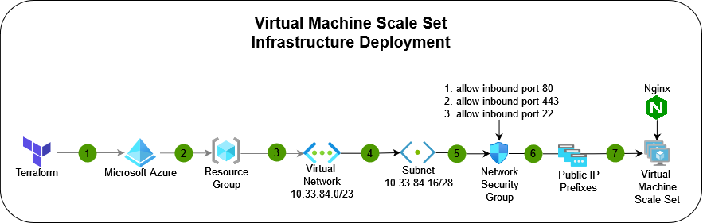
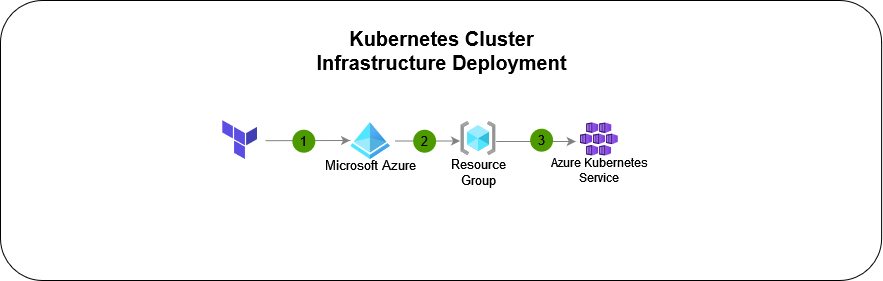

# SRE_Tests

## What this repository does

This repository has been created to deploy multiple resource types in Azure using an Bash/Shell script to automate the deployment. For a more detailed summary please review the `Summary` section below.

### **Summary:**

1. Create an auto scaling web server using a Virtual Machine Scale Set in Azure with a `Hello, World!` webpage using nginx with `Terraform` with a self assigned https certificate pushing traffic through https. 
2. Use an `Ansible` playbook to update the webpage on the Virtual Machine Scale Set to update the webpage with `Hello, World from Ansible`.
3. Use `Terraform` to deploy a Kubernetes cluster in Azure while serving an `Hello World` page, using an official, debian/ubuntu container.

---

### **FAQ**

- **Question:** Why doesn't this repository use CI/CD Pipelines at the moment?
  - **Answer:** This repository has been developed to showcase terraform code modules, with basic http web server deployments, to test a working CI/CD pipeline that would require the users deploying the repository would require active devops cloud agents running in a new repository. It would also depend on the preferred DevOps Platform used to execute the CI/CD deployments. Some may prefer, `Github`, `Jenkins`, `Gitlab` or `Azure DevOps`. This would be alot of time to develop multiple pipelines that support multiple DevOps platforms. This may also cause issues around having a pay wall requirements to get simple `terraform` modules deployed. The conclusion was to provide a fast user friendly method with no pay walls risks or lisencing requirements involved.

- **Question:** Why do you not declare availability zones for your `virtual network` or `subnet` resources in `Azure`?
  - **Answer:** This repository is using `Microsoft Azure` to deploy the cloud infrastructure, per `Microsoft` documentation all `virtual networks` and `subnets` automatically get distrubted to all availability zones in the region. Quote `"Virtual networks and subnets span all availability zones in a region. You don't need to divide them by availability zones to accommodate zonal resources."` [[Reference]](https://learn.microsoft.com/en-us/azure/virtual-network/virtual-networks-overview#virtual-networks-and-availability-zones), therefore allocating availability zones in those resources are not required. However the `Virtual Machine Scale Set` has been setup to use availability zones per the `terraform` module to ensure zone redundancy.

- **Question:** Why have you decided to use a Bash script to deploy the resources in this repository? 
  - **Answer:** Simplicity is the answer here, I wanted to demonstrate a straight forward easy way on deploying Azure resources with nothing more then an active `Azure Subscription`, `Azure Storage Account` & `Service Principal`. There are no paywalls or additional setup requirements to get your deployments working other then basic `Azure` requirements. Developing a bash script allows for everything to be automated end-to-end for all the processes with minimal user input but still show-casing the module capabilities.

- **Question:** Can this repository modules be imported into DevOps Service Platforms?
  - **Answer:** Absoloutely, this repository is completely compatiable with all major DevOps Platform providers, given you have active agents to execute your pipeline tasks for you. It would be easy to implement just replicate the `bash` script tasks into a provider pipeline `.yml` file. All tasks are written in pure `bash` making it super easy to replicate into any CI/CD pipeline `.yml` file or deployment.

- **Question**: Why not use a `powershell` script instead of `bash`?
  - **Answer:** `Powershell` is much slower then bash and a lot of dependancies and modules to import to work. `Bash` is preffered when it comes to speed and efficency with almost no dependencies as majority of functions used come standard. However, it is possible to replicate the `bash` script written to work in `powershell`.

---

## **Pre-requisites**

This repository requires some pre-requisites on the system you will be executing it on please ensure you have the following tools/applications installed.

**Tools/Applications Requirements:**

1. **Terraform**
2. **Azure CLI**
3. **YQ**
4. **Git (for cloning)**
5. **Ansible**

> NOTE: These can all be installed now using the `makefile`, simply install `make` then run the command `sudo make install-all`

**Azure Requirements:**

1. **Azure Subscription**
2. **Azure Resource Group**
3. **Azure Storage Account with Container**
4. **Azure Service Principal**
5. **Contributor Role on Azure Subscription**

**Kubernetes Requirements:**

1. **az aks install-cli**
> NOTE: This has been bundled to be installed using the `makefile`, simply install `make` then run the command `sudo make install-all`

This repository uses an `Azure Storage Account` to store the terraform state files, so they are not persistant on local host.


### Required Service Principal Permissions

To ensure you can deploy the infrastructure, you must have the correct permissions to deploy resources on `Azure`, please ensure your service principal has the permissions `Contributor`, at the `Azure` subscription scope.

[Read about Contributor Role](https://learn.microsoft.com/en-us/azure/role-based-access-control/built-in-roles#contributor)

### Guides for Azure Setup

To ensure you have everything setup in your `Azure` subscription please review the following links for guidance on how to complete some of the pre-requisites that are related to `Azure`.

1. [Azure Service Prinicpal Creation (Official Terraform Website)](https://registry.terraform.io/providers/hashicorp/azurerm/latest/docs/guides/service_principal_client_secret)
2. [Create Azure Resource Group (Microsoft Community)](https://techcommunity.microsoft.com/t5/startups-at-microsoft/step-by-step-guide-creating-an-azure-resource-group-on-azure/ba-p/3792368)
3. [Create Azure Strorage Account (Microsoft Learn)](https://learn.microsoft.com/en-us/azure/storage/common/storage-account-create?tabs=azure-portal)
4. [Assign Azure Roles to Azure Identities (Microsoft Learn)](https://learn.microsoft.com/en-us/azure/role-based-access-control/role-assignments-portal)

---

### Guides for Azure Kubernetes Setup

#### **Azure CLI to Install Kubectl**

```bash
sudo az aks install-cli
```

---

### Installation Guides

If you prefer you can automatically install all software requirements, everything using the `makefile`. Simply run the following commands:

```bash
sudo apt-get install make
make --version
sudo make install-all
```

`Ubuntu/Debian`
#### **Terraform**

```bash
sudo apt-get update && sudo apt-get install -y gnupg software-properties-common

wget -O- https://apt.releases.hashicorp.com/gpg | \
gpg --dearmor | \
sudo tee /usr/share/keyrings/hashicorp-archive-keyring.gpg

gpg --no-default-keyring \
--keyring /usr/share/keyrings/hashicorp-archive-keyring.gpg \
--fingerprint

echo "deb [signed-by=/usr/share/keyrings/hashicorp-archive-keyring.gpg] \
https://apt.releases.hashicorp.com $(lsb_release -cs) main" | \
sudo tee /etc/apt/sources.list.d/hashicorp.list

sudo apt update

sudo apt-get install terraform
```
Reference: [Official Terraform Website for Linux Install](https://developer.hashicorp.com/terraform/tutorials/aws-get-started/install-cli)

---

#### **Azure CLI**

```bash
curl -sL https://aka.ms/InstallAzureCLIDeb | sudo bash
```
Reference: [Install the Azure CLI on Linux](https://learn.microsoft.com/en-us/cli/azure/install-azure-cli-linux?pivots=apt)

---

#### **YQ**

```bash
wget https://github.com/mikefarah/yq/releases/latest/download/yq_linux_amd64 -O /usr/bin/yq &&\
    chmod +x /usr/bin/yq
```
Reference: [Official Github Repository for YQ](https://github.com/mikefarah/yq#install)

---

#### **Ansible**

```bash
sudo apt-add-repository ppa:ansible/ansible -y
sudo apt update -y
sudo apt install ansible -y
```
Reference: [Ansible Install](https://www.digitalocean.com/community/tutorials/how-to-install-and-configure-ansible-on-ubuntu-20-04)

---

#### **Git**

```bash
sudo apt update -y
sudo apt install git -y
git --version
```

---

## **Recommended Operating Systems**

The repository uses a `shell` script to automate everything therefore `Linux` is required to be able to run the bash script successfully. The reason `Linux` was chosen is because majority of functions used within the bash script is installed by default in most `Linux` operating systems.

### **Tested On**

`Operating Systems:`

- ✅ Successful Deployment: **Ubuntu 18.04**
- ✅ Successful Deployment: **Ubuntu 22.04**

`Unix Shell`
- ✅ Successful Deployment: **Zsh**
- ✅ Successful Deployment: **Bash**

## **Deployment Guide**

### **Azure Service Principal - Bash Script**

This section will cover the requirements for the manual deployment using an Azure Service Principal with the bash script.

> NOTE: Please check you have reviewed the required applications and Azure requirements for this script, the script will `exit` and tell you to install if you are missing any requirements.

---

###  **Step 1:** Export Environment Variables (Linux Operating system)

```bash
export ARM_CLIENT_ID="YourServicePrincipalId"
export ARM_CLIENT_SECRET="YourServicePrincipalSecret"
export ARM_SUBSCRIPTION_ID="YourSubscriptionId"
export ARM_TENANT_ID="YourAzureADTenantId"
```

> NOTE: Please keep in mind when you terminate your shell session these export environment variables will get removed.

---

###  **Step 2:** Clone the repository locally and change directory in `scripts/` and edit the `config.yml` file this is required since the shell script has been written using relative directories.

**Clone the Repository**
```bash
git clone https://github.com/DFW1N/SRE_Test.git
```

**Install all software requirements or run the following commands to auto install on `Ubuntu/Debian`:**

```bash
sudo apt-get install make
make --version
sudo make install-all
```

**Change directory into the `scripts/` directory to edit the config file and run the shell script from.**

```bash
cd SRE_Test/scripts
```

**Edit the Config File**
```bash
vi config.yml
```
> Remember to insert by pressing `a`, make the changes then `esc` then type `:wq` to exit if using `vi`. 

**Example of:** `config.yml`
```bash
# This config file has been created so we can use YQ to set variables and pull them into the bash script without having to pass them as input parameters into the script.
Terraform:
  Backend:
    storage_account_name: 'target_storage_account_name' # <--- Change this to your storage account name you want states to be stored in.
    resource_group_name: 'target_resource_group_name' # <--- Change this to the resource group your storage account is stored in.
    container_name: 'tfstate'
```

---

Save the changes in the directory `scripts/config.yml` then continue to **step 3**.

> NOTE: The script has been developed used relative directories so please execute the script while in the `scripts/` working directory.

### **Step 3:** Give relevant permissions then execute the shell script while passing the required input parameters.

**Working Directory** `scripts/`
```bash
chmod 700 azure_manual_deployment.sh
./azure_manual_deployment.sh <input_value> <environment_prefix>
```
> NOTE: Please review the options below to understand what to put in for `<input_value>`, `<environment_prefix>` and other options you have.

#### **Required Shell Inputs:**
`<input_value> ` must match one of the following:
1. `virtual_machine`
2. `kubernetes_cluster`
> NOTE: The `<input_value>` must match one of the values provided above being `virtual_machine` or `kubernetes_cluster`.
---

`<environment_prefix> ` must be `3` letters in length, examples:
1. `uat`
2. `sbx`
3. `npd`
> NOTE: The `<environment_prefix>` must have 3 letters as a prefix, this has been enforced to ensure naming length requirements are met during resource deployments.
---

#### **Optional Shell Inputs:**

1. `-plan`
2. `-destroy`

- You can add `-plan` to check a terraform plan before applying it.
- You can add `-destroy` to destroy your terraform infrastructure for clean up.
- You can combine `-plan -destroy` to plan the destruction of your infrastructure.

---

**Examples**
```bash
./azure_manual_deployment.sh virtual_machine sbx
./azure_manual_deployment.sh virtual_machine sbx -plan
./azure_manual_deployment.sh virtual_machine sbx -plan -destroy
./azure_manual_deployment.sh virtual_machine sbx -destroy
```

---

## Architecture Diagrams

This section will be covering the infrastructure deployed for each deployment solution.

---

### Virtual Machine Scale Set:

This diagram covers the infrastructure deployment for a autoscaling webserver hosted on an `Azure Virtual Machine Scale Set`, that has a self assigned `SSL` certificate.




---

### Kubernetes Cluster:

This diagram covers the infrastructure deployment for a autoscaling webserver hosted on an `Azure Kubernetes Cluster`, that is simply pulling a basic official NGINX webserver image and hosting it over HTTP so you can access it over the internet.




---

## Directory & File Structure

The repository has been broken down into directories with the following files this allows you to have a high overview of the directory structure:

<details>
  <summary>Click to expand directory and file structure</summary>

```bash
docs/
  infrastructure/
    diagrams/
      kubernetes_cluster_infrastructure_diagram.png
      virtual_machine_scale_set_infrastructure_diagram.png
      sre_infrastructure_diagrams.drawio
kubernetes/
  nginx-webserver.yml
ansible/
  inventory/
    hosts.ini
  playbooks/
    update_nginx.yml
scripts/
  azure_manual_deployment.sh
  config.yml
terraform/
   main/
   layers/
      assets/
        provider.tf
        resources.tfvars
        variables.tf
      deployments/
        kubernetes_cluster/
        virtual_machine/
          main.tf
          outputs.tf
          terraform.tfvars
          README.md
      modules/
        base/
          azurerm_resource_group
            config/
              terraform.tfvars
            main.tf
            outputs.tf
        compute/
          azurerm_linux_virtual_machine_scale_set
            config/
              terraform.tfvars
            main.tf
            outputs.tf
        container/
          azurerm_kubernetes_cluster/
            config/
              terraform.tfvars
            main.tf
            outputs.tf
        network/
          azurerm_subnet
            config/
              terraform.tfvars
            main.tf
            outputs.tf
          azurerm_virtual_network
            config/
              terraform.tfvars
            main.tf
            outputs.tf
    main/
      base/
      compute/
        azurerm_linux_virtual_machine_scale_set/
          scripts/
            install_nginx.sh
            run-nginx-install.yaml
          data.tf
          locals.tf
          main.tf
          outputs.tf
          variables.tf
      container/
        azurerm_kubernetes_cluster/
          locals.tf
          main.tf
          outputs.tf
          variables.tf
      network/
        azurerm_network_interface/
          locals.tf
          main.tf
          outputs.tf
          variables.tf
        azurerm_network_security_group/
          data.tf
          locals.tf
          main.tf
          outputs.tf
          variables.tf
        azurerm_public_ip_prefix/
          locals.tf
          main.tf
          outputs.tf
          variables.tf
        azurerm_subnet/
          locals.tf
          main.tf
          outputs.tf
          variables.tf
        azurerm_virtual_network/
          locals.tf
          main.tf
          outputs.tf
          variables.tf
      
```
</details>
---

### What needs to be set up for ansible to be able to control windows machines?

1. Linux machine that is control node must have `Ansible` Installed.
2. Enable Windows Remote Management (WinRM) on the Windows machines that you want to manage.
3. Configure Ansible to use WinRM to connect to the Windows machines.

Here is some example code to manage the windows machine from the master node.

**Hosts file**
```bash
[windows_hosts]
<windows_host_1> ansible_connection=winrm ansible_winrm_port=5985
<windows_host_2> ansible_connection=winrm ansible_winrm_port=5985
```

```bash
---
- hosts: windows_hosts
  tasks:
  - name: Start the service
    win_service:
      name: MyService
      state: started
```

This can be used to perform multiple tasks on Windows machines such as configuraiton, domain joining, setups, software install and much more.

Here are some great references that can be used for using `ansible-galaxy` collections

[Ansible Galaxy Collection Windows Domain](https://docs.ansible.com/ansible/latest/collections/ansible/windows/win_domain_membership_module.html)

```bash
- hosts: winclient
  gather_facts: false
  tasks:
  - ansible.windows.win_domain_membership:
      dns_domain_name: ansible.vagrant
      hostname: mydomainclient
      domain_admin_user: testguy@ansible.vagrant
      domain_admin_password: password123!
      domain_ou_path: "OU=Windows,OU=Servers,DC=ansible,DC=vagrant"
      state: domain
    register: domain_state

  - ansible.windows.win_reboot:
    when: domain_state.reboot_required

```
Reference: [Code Block Shown Above](https://docs.ansible.com/ansible/latest/collections/ansible/windows/win_domain_membership_module.html#examples)

---

### References:

> Please keep in mind some of the links are top level domains that were used to pull multiple resources from this is subjective depending on the link reference.

1. [Terraform AzureRM Registry](https://registry.terraform.io/providers/hashicorp/azurerm/latest)
2. [Terraform Scale Set Resource](https://registry.terraform.io/providers/hashicorp/azurerm/latest/docs/resources/linux_virtual_machine_scale_set)
3. [Availability Zones for Azure](https://learn.microsoft.com/en-us/azure/virtual-network/virtual-networks-overview#virtual-networks-and-availability-zones)
4. [Virtual Machine Scale Set Availability Zones](https://learn.microsoft.com/en-us/azure/virtual-machine-scale-sets/virtual-machine-scale-sets-use-availability-zones?tabs=cli-1%2Cportal-2)
5. [Terraform Cloudinit_config Resource](https://registry.terraform.io/providers/hashicorp/cloudinit/latest/docs/data-sources/config)
6. [Kubernetes Cluster AzureRM Resource](https://registry.terraform.io/providers/hashicorp/azurerm/latest/docs/resources/arc_kubernetes_cluster)
7. [Azure Kuberenetes Cluster Best Practices](https://learn.microsoft.com/en-us/azure/architecture/reference-architectures/containers/aks/baseline-aks?toc=%2Fazure%2Faks%2Ftoc.json&bc=%2Fazure%2Faks%2Fbreadcrumb%2Ftoc.json)
8. [Nginx Official Container Images](https://hub.docker.com/_/nginx/)
9. [Ansible Galaxy Collection for Windows](https://docs.ansible.com/ansible/latest/collections/ansible/windows/win_domain_membership_module.html)
10. [OpenSSL Essentials for Self Signed Certificates](https://www.digitalocean.com/community/tutorials/openssl-essentials-working-with-ssl-certificates-private-keys-and-csrs)

---

### **Author**

Made with ❤️ by **Sacha Roussakis-Notter**
